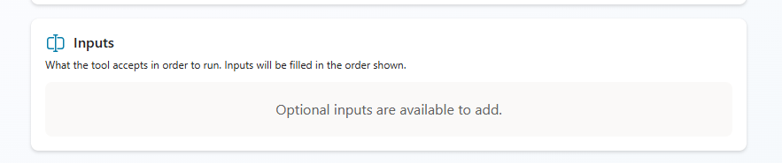
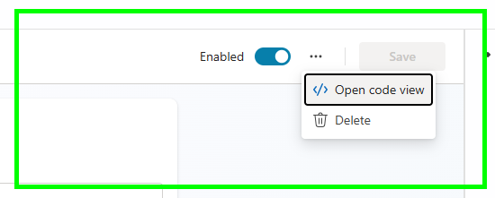
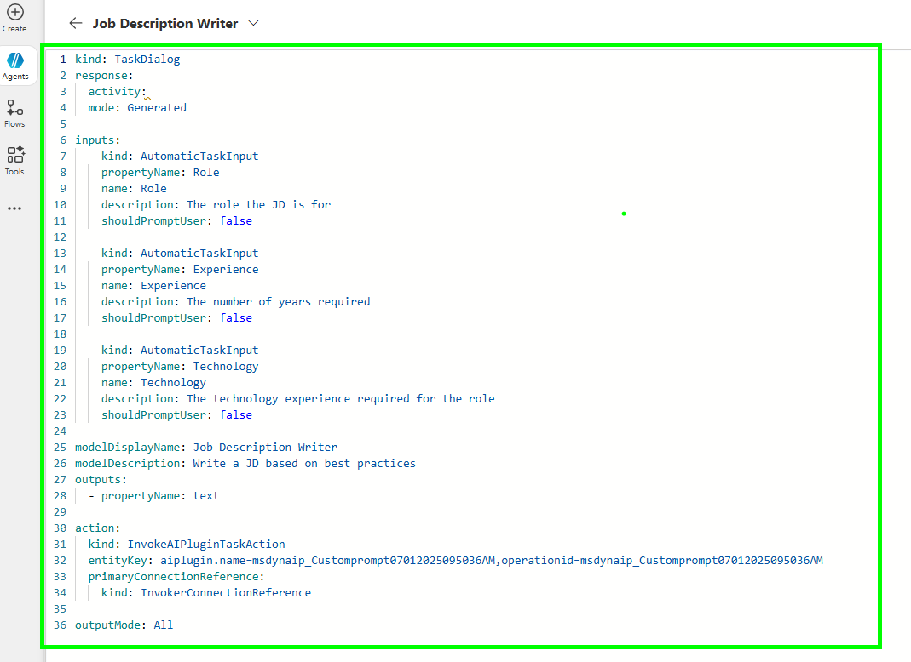

## **Fixing Prompt Input Issues in Copilot Studio with YAML**

If you've worked with Copilot Studio and tried reusing prompts across agents, you've likely run into a frustrating issue: your carefully designed inputs—like role, experience, and technology—disappear when the prompt is reused.

### **The Problem**
When you add a custom prompt to an agent, the input fields often don’t carry over. This breaks the functionality and forces you to recreate prompts manually for each agent.

### **The Fix**
The solution lies in editing the prompt in **code view** and defining the inputs using **YAML**. Here’s what you need to include for each input:

- `kind`: Usually set to `automatic task input`
- `name`: The display name (e.g., "Role")
- `property name`: The internal name used in the tool (e.g., `role`)
- `shouldPromptUser`: Set to `false` if you don’t want the user to be prompted

💡 **Tip:** If your property name includes spaces, Copilot Studio encodes them as `_20` (e.g., `job_20role`). This is similar to how URLs handle spaces.

### **Why It Matters**
Defining inputs properly in YAML allows you to:
- Reuse prompts across multiple agents
- Maintain consistency in your tools
- Avoid redundant configuration work

### **Final Thoughts**
This small but powerful fix helps streamline your workflow in Copilot Studio. As the platform evolves, these kinds of manual tweaks may become obsolete—but for now, they’re essential for getting the most out of your custom tools.

