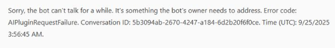
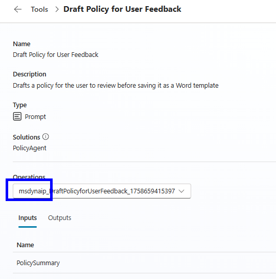
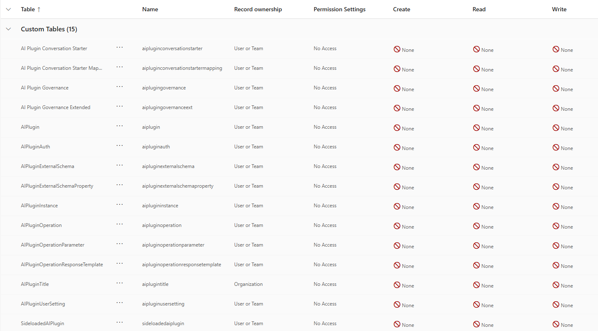
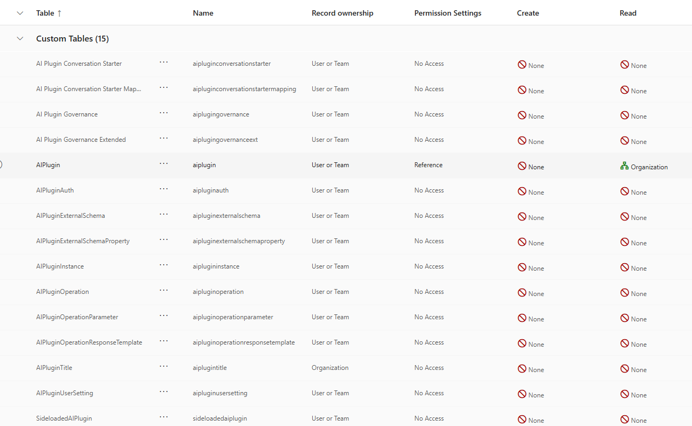

---

title: "Copilot Studio Agent Prompt Tools: AIPluginRequestFailure"
date: "2025-10-6"
slug: "copilot-studio-agent-prompt-tools-plugin-not-found"
video: ""
hero_image: ""
hero_image_alt: ""
hero_image_credit_text: ""
hero_image_credit_link: ""
related_posts: []
series: "Copilot Studio"
stack: ["Copilot Studio"]
next: ""
previous: ""
---
# Resolving AIPluginRequestFailure in Copilot Studio Prompts

When working with Copilot Studio and deploying prompts as tools across different environments, you may encounter the following error:

> Sorry, the bot can't talk for a while. It's something the bot's owner needs to address. Error code: AIPluginRequestFailure.



This error can be frustrating, especially when all components appear to be deployed correctly. In this post, I'll walk through the root cause, how I diagnosed and resolved the issue, and share some best practices for using prompts as tools in Copilot Studio.

## The Scenario: Prompts as Tools Across Environments

Copilot Studio allows you to create prompts and expose them as tools, making it easy to reuse logic and accelerate agent development. One of the key benefits of this approach is the ability to package prompts into solutions and deploy them across environments (e.g., dev, test, prod) for consistency and reusability.

However, when deploying a solution containing prompt tools, you might find that agents work in one environment but fail in another, even when all solution components are present.

## The Error: AIPluginRequestFailure

In my case, after deploying a solution and ensuring all components were present, I encountered the following error when invoking a prompt tool:

```
Sorry, the bot can't talk for a while. It's something the bot's owner needs to address. Error code: AIPluginRequestFailure.
```

## Diagnosing the Issue

After verifying that:

- The solution was deployed successfully
- All required components (prompts, tools, agent, etc.) were present

I started investigating further. While editing the tool, I noticed the name included `MSDYN_`, indicating it was stored in a Dataverse table. This led me to check security roles and table permissions.



### Security Role Permissions

By default, users are assigned the "Basic User" security role. However, this role does **not** have access to the custom tables (such as those prefixed with `MSDYN_`) where prompt tools are stored.

This lack of table access prevents the agent from invoking the tool, resulting in the `AIPluginRequestFailure` error.



## The Solution: Custom Security Role with Table Access

To resolve the issue:

1. **Create a Custom Security Role** (e.g., `AI User`).


2. **Grant Access to Required Tables**: Ensure this role has at least read access to the tables storing your prompt tools (look for tables with `AIP` in their names).



3. **Assign the Role to Users**: Add the custom role to any user who needs to interact with the agent.

After assigning the new role, the agent was able to invoke the prompt tool without error.

## Benefits of Using Prompts as Tools

Using prompts as tools in Copilot Studio offers several advantages:

- **Reusability**: Prompts can be packaged and reused across multiple agents and environments, reducing duplication and maintenance overhead.
- **Consistency**: Centralized prompts ensure consistent logic and responses, especially when deployed as part of a managed solution.
- **Rapid Deployment**: Tools can be updated and redeployed quickly, streamlining the development lifecycle.
- **Separation of Concerns**: Business logic can be encapsulated in prompts, making agents easier to manage and extend.

## Best Practices for Deploying Prompts as Tools

- **Always review security roles and table permissions** when deploying to new environments.
- **Document required table access** for your solutions, especially for custom tables.
- **Test with user accounts** that mirror production roles to catch permission issues early.
- **Leverage custom roles** to grant only the necessary permissions, following the principle of least privilege.

## Conclusion

The `AIPluginRequestFailure` error in Copilot Studio is often a symptom of missing table permissions for the user invoking a prompt tool. By creating a custom security role and granting access to the relevant tables, you can resolve this issue and fully leverage the power of prompts as reusable tools across environments.

If you encounter similar issues, check your security roles and table permissions first—they're often the key to a quick resolution.


