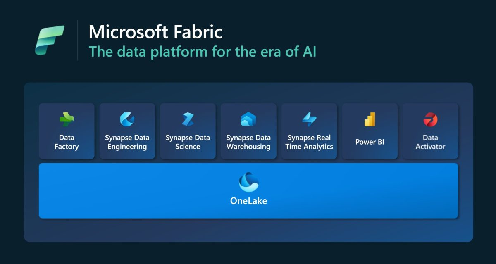

---

title: "From Chaos to Clarity: How Microsoft Fabric is Transforming Business Data"
date: "2025-10-24"
slug: "using-microsoft-fabric-to-transform-business-data"
video: ""
hero_image: ""
hero_image_alt: ""
hero_image_credit_text: ""
hero_image_credit_link: ""
related_posts: []
series: "Fabric"
stack: ["Fabric"]
next: ""
previous: ""
---
# From Chaos to Clarity: How Microsoft Fabric is Transforming Business Data

In today’s data-driven world, businesses are drowning in information—but starving for insight. Fragmented systems, duplicate records, and clunky reporting tools like Excel exports from NetSuite are still the norm. But what if there was a way to bring it all together into one clean, trustworthy source of truth?

That’s exactly what Hein Taljaard explored in a recent Lunch and Learn session, introducing the team to **Microsoft Fabric**—a unified data platform designed to consolidate, clean, and activate business data for smarter decision-making.

## **The Problem: Data Everywhere, Insight Nowhere**

Hein kicked off the session by highlighting the common challenges businesses face with their data:

- **Fragmented systems** that don’t talk to each other
- **Incomplete or duplicate records** that muddy the waters
- **Basic reporting tools** that require manual exports and manipulation

These issues don’t just frustrate analysts—they actively hinder strategic decisions like resource planning and financial forecasting.

## **The Solution: Data Consolidation with Microsoft Fabric**

Enter **Microsoft Fabric**, a platform built to unify structured, transactional data—think sales records, timesheets, and sensor data—into a single, analysable format.

Hein emphasised that the goal isn’t just centralisation for its own sake. It’s about creating a **single source of truth** that supports accurate insights and enables AI to do its job properly. Because let’s face it: AI is only as good as the data you feed it.

Even modest improvements in data quality can unlock significant commercial value. And Fabric is designed to make those improvements accessible.

## **What Is Microsoft Fabric, Really?**

Fabric isn’t a standalone product—it’s a smart repackaging of existing Azure analytics tools, tightly integrated with **Power BI** and designed to be user-friendly.

Here’s how Hein broke it down:

- **Resources in Azure**: Fabric resources are created as virtual machines with Python workloads for data ingestion and transformation.
- **Storage in OneLake**: All data lands in OneLake, Microsoft’s centralised data lake.
- **Governance and Copilot**: Fabric integrates with governance tools and Copilot for enhanced control and automation.
- **Low-Code and Code-Based Options**: Whether you're a data engineer or a business analyst, Fabric supports both styles of work.

## **How It Works: From Ingestion to Insight**

Hein walked the team through a practical demo, showing how to set up dataflows in Fabric:

1. **Create Workspaces and Capacities**: Link to Azure and choose the right capacity level based on cost and scale.
2. **Ingest and Clean Data**: Use Dataflow Gen 2 to connect to sources, select tables, rename columns, remove unnecessary fields, and handle nulls.
3. **Build Semantic Models**: Define relationships between tables (e.g., accounts and contacts) to support accurate reporting.
4. **Visualise in Power BI**: Generate reports and dashboards that reflect the cleaned, structured data.

He also addressed technical questions from Oskar, explaining how schema changes and data updates are handled differently in low-code vs. code-first approaches.

## **Fabric as a Service: Scalable Solutions for Every Client**

Beyond the tech, Hein introduced the team’s commercial strategy:

- **Standardised Consulting Packages**: For clients who need repeatable, cost-effective solutions.
- **Project-Based Engagements**: For larger clients like MLC, where bespoke solutions are required.

This dual approach allows the team to scale their offerings while maintaining flexibility.