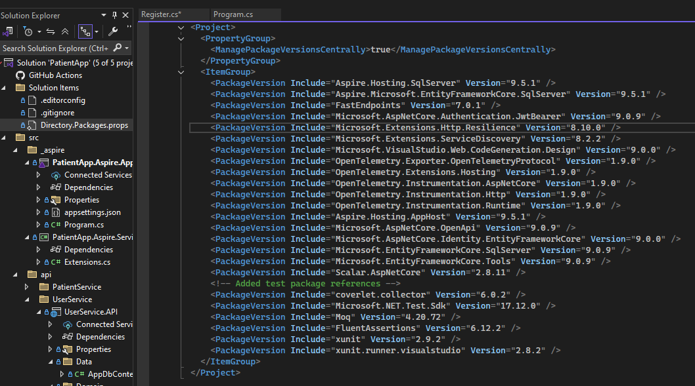
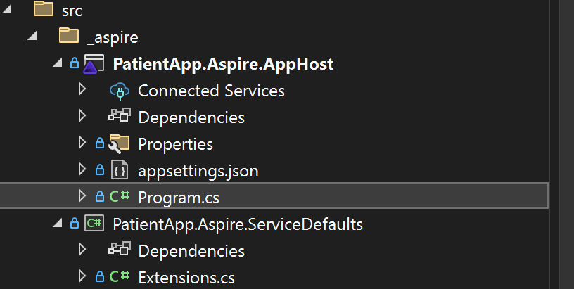
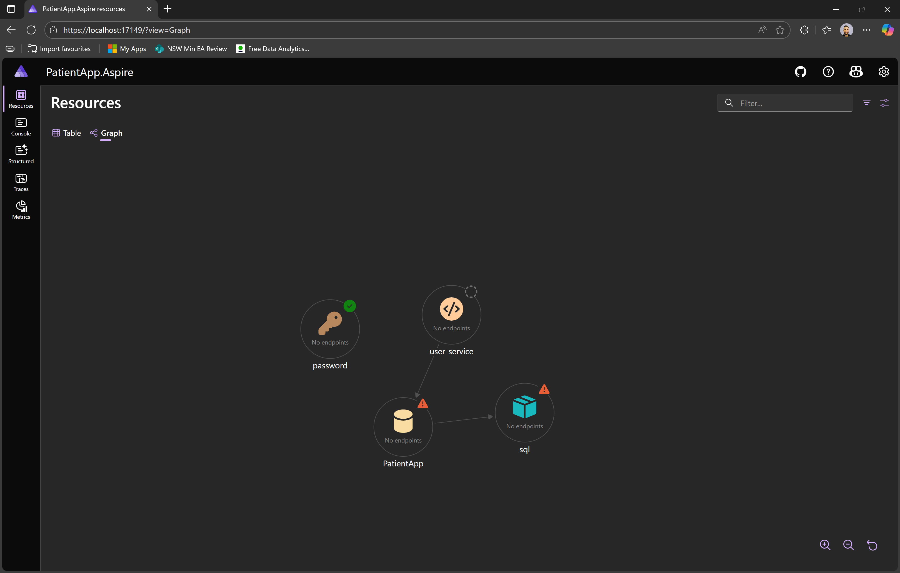

# Introduction
Gettting a new project set up is almost like starting a new world in Minecraft or walking the first few steps of n bush walk on a route you don't know yet (Pick your poison). There are so many decisions to make but all projects have a similar base. When setting up a project, I think about how my team will work together, what the typical structure needs to look like (typically split by Business Domain - or "Vertical Slice"). 

When I kicked off #patientapp, I asked myself a few questions to help me figure out what I need to do first. These questions are split into Tech Questions and Business Questions. 


| Tech Questions | Business Questions |
| -------------- | ------------------ |
| How do I make it easy for me (the team) to keep the code base clean and consistent? | What are the main areas (Domains) of the use case? |
| How can I make it easy for the app to scale? | What type of users will be using the app? |
| Are there any libraries we shouldn't use due to technical or commercial concerns? | What are some of the early critical paths I can identify (this will evolve) |
| How am I going to deploy this? (This one is a bit premature) |  |
| If I am building a Microservice or Modular Monolith (My favourite architecture at this point), how do modules communicate? | |


Now that you have the questions, let's take a look at some of decisions I made so far.


# Making it easy to build (and later deploy)

## Keep everyone rowing in the same direction

Ok...

Step 1 - ```.gitignore```. Nothing worse than a repo cluttered with stuff that shouldn't be there. This one is obvious. 

Step 2: - ```.editorconfig```. All the code will roughly look the same, easy peasy. 

Step 3: - This one people forget. **Central Package Management**. Create a ```Directory.Packages.props``` file at the root of your repo (same level as your solution file). This way, all your package versions go in one place while the ```cproj``` files will only contain references...



## Dev-Time Orchastration

We have all been there... that moment when you notice you spent endless hours crafting the exact ```appsettings.json``` file and then you wipe your machine... Or a new Dev Starts and no one thinks to tell them to copy the file from the super secret folder that the CISO is not allowed to know about because it contains keys that technically shouldn't be kept there... 

Despite the evolution of our tools and practices, people still do that... not me of course... but who are we to judge?

**.NET Aspire** has been my favourite new technology, despite all the AI hype that has been going on over the last few years. Devs can go back to being Devs not DevOps Engineers and Docker Compose Specialists. Not only that, it helps build your project with best practices from some of the top .NET Engineers in the world! WITH ONE LINE OF CODE! I am not saying follow the ```Service Defaults``` project blindly, but it has such power.

The first decision I made was to start to project using .NET Aspire. It helps you quickly and easily put distributed apps together in a way that will help you keep track of what is where and who is dependent on what etc. 

The 2 main components that we care about now are the ```AppHost``` and ```Service Defaults```. Both are shiny new (well, relatively new) projects from Microsoft. 



### AppHost
The ```AppHost``` becomes your starting point. It is the start up project for the solution and its the place where you register all the new resources you need. I am not going into too much technical detail, but one really cool thing I liked was the ability to spin up a SQL Docker Container and set the password when you start the project... 

```csharp
var password = builder.AddParameter("password", secret: true);

```

One Challenge I faced was that I could not access the container when the ```AppHost``` wasn't running. I found this out because I was not keen on building an ```EF Core Migration``` from code, I still need to get there, but I wanted to see some results. Apparently, this is coming in v10 of Aspire, but for now, you need to use an experimental feature called ```.WithEndpointProxySupport(false)```.

```csharp
#pragma warning disable ASPIREPROXYENDPOINTS001 
var dbServer = builder.AddSqlServer("sql")
                      .WithPassword(password)
                      .WithHostPort(1433)
                      .WithDataVolume()
                      .WithEndpointProxySupport(false)
                      .WithLifetime(ContainerLifetime.Persistent);
#pragma warning restore ASPIREPROXYENDPOINTS001 

```

The ```AppHost``` Dashboard is where it's at... This little beauty allows you to see all resources and even has a nice view to see relationships and check traces for your telemetry... nice😎.



### Service Defaults

For all the flash of the ```AppHost``` the value of the ```Service Defaults``` project can quickly go unnoticed. On papaer, the ```Service Defaults``` is a set of extension methods that help you have consitency across your app. The part that goes unnoticed is that it builds in resiliency, OTEL and Health Checks... Consistently... on ALL your projects... No Engineer likes doing these things. Its the equivalent of going to the dentist. The beauty is that you need 2 lines of code after referncing the ```Service Defaults``` project. 

```csharp
builder.AddServiceDefaults(); //Aspire

///more code

app.MapDefaultEndpoints();
```
## DevOps

No spoilers here - but Aspire allows you to very easily go from dev to deploy. The AppHost can be deconstructed and deployed as an Azure Container App. As fare as I know, more options are available now, but as we are just getting started, its good enough for me to know (as a design decision) that Aspire allows me to deploy my solution without being super proficient in CI/CD. This is a skill engineers should develop but as far as designing for simplicity goes, I don't see a better alternative at this stage... so... Aspire it is. More on this later.

## Multi Tenancy

I know this app is meant to be Multi Tenanted. Now, you can do this in 2 main ways - splitting the code or splitting the infrastructure. I have gone down the "splitting the infrastructure" path before and I still have nightmares. So, as a design decision, I am chosing to "split the code". This is done in a few steps.

- When the user logs in, we will add tenants to the JWT. The UI will be responsible for allowing the user to Pick a Tenant. This only applies to practicioner workloads as the actual patient part will be very isloated. Once the tenant is set (stored in a cookie to make it easier for the user later), the selected tenant will always be part of the ```HTTPContext```. We will then use EF Core's ability to enforce a query filter on every dataset (API) at runtime. Example Below.

```csharp
public class TenantEntity
{
    public int Id { get; set; }
    public int TenantId { get; set; }
    // ...other properties...
}

public class AppDbContext : DbContext
{
    private readonly int _currentTenantId;

    public AppDbContext(DbContextOptions<AppDbContext> options, int currentTenantId)
        : base(options)
    {
        _currentTenantId = currentTenantId;
    }

    public DbSet<TenantEntity> TenantEntities { get; set; }

    protected override void OnModelCreating(ModelBuilder modelBuilder)
    {
        modelBuilder.Entity<TenantEntity>()
            .HasQueryFilter(e => e.TenantId == _currentTenantId);

        // Add index on TenantId
        modelBuilder.Entity<TenantEntity>()
            .HasIndex(e => e.TenantId);
    }
}

```

> REMEMBER: Put an index on the column you want to filter on. 

# Build APIs FAST

Fast Endpoints has been a game changer for me when it comes to building APIs quickly and cleanly. The ability to split endpoints into their own classes means you can keep your codebase organized and avoid the dreaded 1000-line controller files. Each endpoint gets its own little home, making it super easy to reason about, refactor, and—most importantly—test. Testability is baked in, so you can write focused unit tests for each endpoint without jumping through hoops. The framework also encourages clear separation of concerns, so you’re not mixing business logic with HTTP plumbing. Add in features like automatic validation, dependency injection, and lightning-fast performance, and you’ve got a recipe for APIs that are not just fast to build, but also robust and maintainable.

I like CQRS and REPR (Goolge them if you don't know what they are). It just makes life easy and keeps my boundaries nice and clean. Now, in the patient app so far, we haven't used CQRS but, it is a design decision that needs to be recorded. ```MediatR``` was the go-to for a long time. It has gone commercial at the time of this writing and (at least for what I need) FastEndpoints let you do the same thing. 

So, let's look at an endpoint. 

First, you create a normal class and make it inherit from ```Endpoint<TRequest, TResponse<>>```. Fast Endpoints allow you some wiggle room here, but I like the option where you have strongly typed responses.  You then override the ```Handle``` method and optionally, the ```Configure``` method. 

```csharp
internal sealed class Register(UserManager<ApplicationUser> userManager, ILogger<Register> logger) 
    : Endpoint<RegisterRequest, Results<Ok<RegisterResponse>, BadRequest>>

        public override void Configure()
    {
        Post("/api/register");
        AllowAnonymous();
    }

    public override async Task HandleAsync(RegisterRequest req, CancellationToken ct)
    {
        var user = await _userManager.FindByEmailAsync(req.Email ?? string.Empty);

        if (user is not null)
        {
            _logger.LogWarning("User with email {Email} already exists", req.Email);
            await Send.ResultAsync(TypedResults.BadRequest("Unable to register user"));
            return;
        }

        try
        {
            IdentityResult newUserRequest = await _userManager.CreateAsync(new ApplicationUser
            {
                Email = req.Email,
                UserName = req.Email
            }, req.Password);


            if (newUserRequest.Succeeded)
            {
                await _userManager.AddToRoleAsync(user, "User");
                await Send.ResultAsync(TypedResults.Ok(new RegisterResponse(true)));
            }
            else
                await Send.ResultAsync(TypedResults.BadRequest(newUserRequest.Errors.FirstOrDefault()));

        }
        catch (Exception ex)
        {
            _logger.LogError(ex, "Error occurred while registering user");

            throw;
        }
    }

//More Code 

//Request and Response for REPR
internal sealed record RegisterRequest(string Email, string Password);

internal sealed record RegisterResponse(bool success);
```
Easy right? It gets better. 

Fast Endpoints automatically tries to find the appropriate validator, so in the same file I just add a quick validator class... ASP.NET Identity actually takes care of this for validating the password, but this is the best example we have at this stage or our app...

```csharp

internal sealed class RegisterValidator : Validator<RegisterRequest>
{
    public RegisterValidator()
    {
        RuleFor(x => x.Email)
            .NotEmpty()
            .EmailAddress();
        RuleFor(x => x.Password)
            .NotEmpty()
            .MinimumLength(6)
            .Matches("[A-Z]").WithMessage("Password must contain at least one upper case letter.")
            .Matches("[a-z]").WithMessage("Password must contain at least one lower case letter.")
            .Matches("[0-9]").WithMessage("Password must contain at least one number.")
            .Matches("[^a-zA-Z0-9]").WithMessage("Password must contain at least one special character.");
    }
}

```

# User first, customer second

## Registration and Central User Management

I decided to manage all user properties (not patient properties) centrally. You need to be a user first before you are a Patient, Practicioner or whatever else we decide on doing later. The user service for now uses ASP.NET Identity to register and log a user in. Later we will introduce the ability to register / log in with your socials but I decided to keep it simple now to move on to more valuable tasks...

**This is something you need to consider when planning work. Your team can easily get distracted by lower-value tasks. If you need to show results quickly (POC), consider the critical path and be RUTHLESS about what you keep in scope.**

ASP.NET Identity has everything we need to get going. After Installing the packages 

```xml
 <PackageReference Include="Microsoft.AspNetCore.Authentication.JwtBearer" />
 <PackageReference Include="Microsoft.AspNetCore.Identity.EntityFrameworkCore" />  

```

You can get going quickly. The .NET Team has given us scaffolding options i.e. they have built pages and classes for us. As we are not building the UI yet, I am going to skip that but getting Identity to work requires a few easy steps.

Your ```DBConctext``` needs to inherit from ```IdentityDBContext``` and the class representing your users needs to inherit from ```IdentityUser```.

```csharp
internal sealed class AppDbContext : IdentityDbContext<ApplicationUser>

```

```csharp
public class ApplicationUser: IdentityUser
```

You also need to implement an email sender

```csharp
public class FakeEmailSender : IEmailSender<ApplicationUser>
```
Now, Dependency injection. Here are some of the methods you need to have in ```Program.cs```. I am not going to go over each of them individually.

```csharp
builder.Services.Configure<JwtOptions>(builder.Configuration.GetSection("Jwt")); //See section below

builder.Services.AddAuthorization();

builder.AddSqlServerDbContext<AppDbContext>("PatientApp"); // EF Core

builder.Services.AddSingleton<IEmailSender<ApplicationUser>,FakeEmailSender>();

builder.Services.AddIdentity<ApplicationUser, IdentityRole>()
    .AddRoleManager<RoleManager<IdentityRole>>()
    .AddUserManager<UserManager<ApplicationUser>>()
    .AddEntityFrameworkStores<AppDbContext>();


// more code

app.UseAuthentication();
app.UseAuthorization();

//app.MapIdentityApi<ApplicationUser>(); I took this out in favour of building my own. If you want to use all the default behaviours, you can look at using the built in endpoints.

```

If this feels like a lot, don't worry. When I started with Identiy, it was a lot for me too. YouTubue is littered with "Getting started with ASP.NET Identity" videos, so you will figure it out easily enough. 

## JWT

JWT (Jason Web Tokens) is a way to securely authorise and validate user claims. Now, JWT can be a lot, but here is what you need to know right now:

- The ```UserService``` has a loging method. This uses the ```UserManager``` from Identity to validate the user. 
- The ```Login``` endpoint then reads the ```JWT``` config which has the following key properties and thanks to Aspire, I can easily keep all my apps up to date
    - Issuer
    - Audience
    - Key
    - ExpirationInMunutes
- The JWT is generated by the User Service
- We will add the user roles and tenants to the claims (more on this later, I am still on the fence about the implementation)
- The consuming services will have the same JWT settings and will ensure that all the properties are in sync with what it needs to validate the JWT.
- You could do this from a central service like OAuth. I would probably suggest that aproach for a real app, but hey, let's have some fun.

Remember our AppHost??? Here is how I registered the User Service with all the settings I need 😁... how good... no more ```appsettings.json ```

```csharp

var userService = builder.AddProject<Projects.UserService_API>("user-service")
                         .WithReference(db)
                         .WaitFor(db)
                         .WithUrlForEndpoint("https", url =>
                         {
                             url.DisplayText = "Scalar HTTPS";
                             url.Url = "/scalar";
                         })
                         .WithEnvironment("Jwt__Issuer", jwtSection["Issuer"] ?? string.Empty)
                         .WithEnvironment("Jwt__Audience", jwtSection["Audience"] ?? string.Empty)
                         .WithEnvironment("Jwt__Key", jwtSection["Key"] ?? string.Empty)
                         .WithEnvironment("Jwt__ExpirationInMinutes", jwtSection["ExpirationInMinutes"] ?? string.Empty);

```

Well, that is about as much as I have to say for our first entry... hope someone reads this... if not, at least I will remember it (I hope).

Till next time.