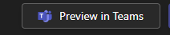

# Introduction

I have been working on a web app for a while and a client asked us if we can add the app to Teams as a personal app. Initially, this seemed like a trivial thing to do, but it ended up causing quite the mess for me to manage, so I thought I would do a step-by-step guide to work through how I managed to get my existing React and DotNet app running in teams. 

## Background

The app uses React as the client, connecting to a DotNet API. We are also using MSAL-react and Entra as the auth provider for the API. We have an app registration registered that the client and API use. 

# Problems we encountered

## Sign In Not Working
We used [The Teams Developer Portal](https://dev.teams.microsoft.com/home) to create the app. The process is pretty simple. We added the URI of the app as a personal tab and used Preview in Teams to see what it would do. 




As we initially used the ```LoginPopup()``` from MSAL-react, viewing this in the browser did not give any issues. Only when testing it in the Client App did we see it didn't work. We then changed to ```LogingRedirect()```, but that broke everything. 

Despite our deepest desires - we now needed to build in actual SSO with Teams.

## Scope (Audience) did not match Iframe

We used the default Application ID URI that gets provisioned when exposing an API in Entra. This served its purpose and worked very well up to this point. Teams requires the URI to match the hostname of your app e.g., https://my.app.com needs to be api:my.app.com. The documentation says it should follow the format api://hostname/appid, but we didn't do that - we just added the hostname and it worked. 


## API No Longer valid

After getting the app to log in properly, we now had the issue that, because the audience changed (Application ID URI), we were no longer able authenticate to the API. This was because, when using Microsoft Identity Web, you bind a specific section of your config to the auth configuration. if you DO NOT provide an Audience, the audience is defaulted to ```api://<client id>```. The audience here needs to match the Application ID URI I spoke about earlier. 

```csharp
builder
    .Services
    .AddAuthentication(JwtBearerDefaults.AuthenticationScheme)
    .AddMicrosoftIdentityWebApi(builder.Configuration.GetSection("AzureAd"));

```

```json
"AzureAd": {
    "Instance": "",
    "TenantId": "",
    "ClientId": "",
    "ClientSecret": "",
    "Domain": "",
    "Audience": ""
  }
```

# Setting everything up. 

Ok, enough background. Lets walk through all the steps and see how to set this up. 

## Entra
If you haven't yet, [create an app registration in Entra](https://learn.microsoft.com/en-us/entra/identity-platform/quickstart-register-app?tabs=certificate%2Cexpose-a-web-api).

Navigate to "Expose an API" and configure the following as per the image below


1. The Application ID URI needs to be at least in the format ```api://<web host url>``` though the documentation suggests ```api://<web host url>/application id```.
2. You need at least 1 scope that is called ```access_as_user```. This is mandated by Teams. 
3. The 2 apps that have not been commented out, are the Teams Desktop and Teams Web clients. both at least need access to the ```access_as_user``` scope.   

## Teams Developer Portal
This portal is a gem. it allows you to create apps through a UI and publish them to your org. Saving you from both having to parse the manifest yourself and having to explain to your IT team what the zip file is and that you can actually trust developers when we tell you to upload something 😉

When creating an app or editing one, there are a few things to point out here:

1. Under Basic Information > **Application ID** is the Application Id in Entra.
2. Under Single Sign On > **Application ID URI** is the full URI we set up in Entra. Not the scope (access_as_user), just the (api://<web host url>) piece.

## Client Auth
You may already have some auth built into your app already, so you need to consider that and incorporate it into your implementation. We ended up creating an auth abstraction and handling the the Login, Logout and Account Details in a custom hook. This way, the hook was able to:

1. Verify if the app is running in Teams
2. If so, login silently and get the auth token (which is then stored as state in the abstraction)
3. If not, navigate to the login screen and use MSAL. The MSAL flow then uses the same principles as the Teams SSO flow - the token is stored in state. 

This does mean that we could not use the ```<Authenticated>``` component form MSAL-react, but we only used that in one place, so it wasn't too much of a mission to change. 

So, first, install the Teams node package.

```bash
npm install @microsoft/teams-js
```

Create a state variable in your hook (you can pass it to your own provider as well, but this is not a lesson in react.) We made our abstraction look the same as the ```AccountInfo``` type in MSAL for simpliciy. 

```typescript
  const [userAuth, setUserAuth] = useState<UserAuth>({
    userAccount: account,
    accessToken: "",
    roles: [],
  });
```
We then have a method that tries logging into Teams and sets the ```isInTeams``` state variable. You will get a very specific error when not in Teams, so the method below could probably be optimised to look specifically for **"No Parent Window Found"**.

```typescript
 const tryLogIntoTeams = async (): Promise<void> => {

      try {
        await microsoftTeams.app.initialize();

        var token = await microsoftTeams.authentication.getAuthToken({
          resources: [config.apiScope]
        });

        var decodedToken: { roles: string[], upn: string, name: string } = jwtDecode(token);
        setUserAuth({
          accessToken: token,
          roles: decodedToken.roles,
          userAccount: {
            name: decodedToken.name,
          } as AccountInfo
        });

       setLoginMessage("Logged into Teams as " + decodedToken.name);

        setIsInTeams(true);

      } catch (error) {
        setIsInTeams(false);
        setLoginMessage("Error logging into Teams: " + error);
      }
    }
```

The ```apiScope``` is not the ```access_as_user``` scope we created for Teams in this case, but, if you want, you can reuse the ```access_as_user``` scope for your application. 

We moved our MSAL code to a function instead of just running it in the effect. 

```typescript
    const getAccessToken = async () => {
      setLoadingInfo("Loading user...");
      setLoading(true);
      await instance.initialize();
      if (account) {
        const request = {
          scopes: [config.apiScope],
          account: account,
        };
        await instance.acquireTokenSilent(request).then(async (response) => {
          if (response) {
            const decodedToken: { roles: string[] } = jwtDecode(
              response.accessToken
            );
            setUserAuth({
              userAccount: account,
              accessToken: response.accessToken,
              roles: decodedToken.roles,
            });
          } else {
            setNotificationType(AlertType.Error);
            setNotificationText(
              "Cannot get user access token. Please contact admin."
            );
            setShowNotification(true);
          }
        });
      }
      setLoading(false);
    };
```

Finally, the effect looks something like this:

```typescript
    tryLogIntoTeams();

    if (!isInTeams) {
      getAccessToken();
    }

    setInitialLoadComplete(true);
```
The effect has dependencies on the ```account``` (MSAL),```instantce``` (MSAL) and ```isInTeams``` state variables. 

## API
On the API Side, not much had to change. We updated our App Settings to include the Audience in the "AzureAd" section of the config and that took care of that. 

# What about local development?
Local debugging was interesting as you need to run both your client app and API in tunnels. I only have a free NGROK account, so I used NGROK to tunnel the client app and Visual Studio's Dev Tunnels to tunnel the API. 

- During local Development, the Application ID URI needs to be set to the the NGROK host name provided when you start tunneling. 
- Your client needs to point to the Dev Tunnel provided by your IDE (Visual Studio in my case) as the iFrame that your app will run in cannot get to ```localhost:7108``` (or anything on local host for that matter).


