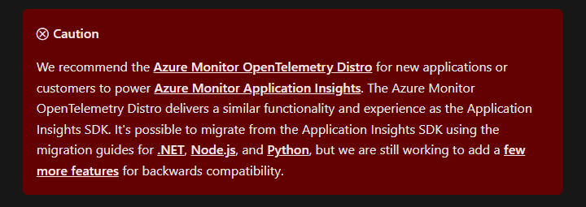
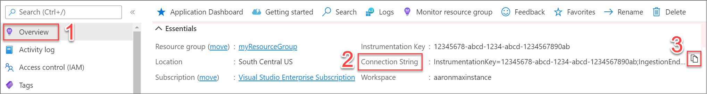

# Introduction
We recently used a combination of Serilog and Azure Application Insights / Azure Monitor for structured logging. We had a massive Telemetry Push for our application to see
how people are using it and well, logging came along for the ride. This article goes over some of the challenges I faced during the initial implementation that I wanted to share and hopefully help some one who is facing the same problem. 

## What is OpenTelemetry (OTEL)?
OpenTelemetry (OTEL) is an open-source observability framework for cloud-native software, designed to provide standardized methods for 
collecting and exporting telemetry data such as traces, metrics, and logs. It is important because it enables developers to gain deep insights into the performance and behavior of their applications, facilitating easier debugging, performance tuning, and monitoring. By using OTEL, organizations can achieve better observability, leading to improved reliability and user experience.

## Serilog
I am a big fan of Serilog. Its is flexible and has a massive support base for a variety of exporters "Sinks" as they are known. Serilog also allows you to keep your export settings in your config file which makes it really useful and flexible across your multiple deployments. While developing, you can use the console exporter, then test your connection to something like Azure Application Insights.

The one gotcha for me was ensuring that Serilog is used as the logging provider in your application. After setting up Serilog to load your config, you have to ensure that you configure your app to use Serilog as the logging provider. Luckily, you can do all this in 1 step. If you don't do ```UseSerilog``` your ```ILogger``` will use the normal logging provider provided by DotNet. 

```csharp
builder.Host.UseSerilog((_, config) => config.ReadFrom.Configuration(builder.Configuration));
```

And here is how that config file looks:

```
Serilog": {
    "Using": [
      "Serilog.Sinks.ApplicationInsights"
    ],
    "MinimumLevel": {
      "Default": "Information",
      "Override": {
        "Microsoft": "Warning",
        "System": "Warning"
      }
    },
    "WriteTo": [
      {
        "Name": "ApplicationInsights",
        "Args": {
          "telemetryConverter": "Serilog.Sinks.ApplicationInsights.TelemetryConverters.TraceTelemetryConverter, Serilog.Sinks.ApplicationInsights"
        }
      }
    ],
    "Enrich": [
      "FromLogContext"
    ],
    "Properties": {
      "Application": "Anabelle"
    }
  }
```
# Challenges and Consideration

## SDKs and Terminology
Probably the biggest issue for me was getting my head around how Serilog worked in conjunction with Open Telemetry. I watched a few courses on YouTube and Dometrain which mostly focused on the traditional setup. The OTEL website also focuses on the OOB logging provider, so it took a minute, but we got there in the end. 

Outside of the Serilog problem, getting used to the OTEL terminology took some doing. Metrics and Logs were pretty easy to understand, but Traces took a some time. I underestimated Traces - initially I just cared about Metrics for my apps and logging is... well... its logging. But being able to trace your application's activity as it calls the levels of code in your application is so powerful. It even works in distributed systems, though that takes some doing. 

## Applicatoin Insights vs Azure Monitor
According to the Application Insights Sink Repo, you need to add Application Insights Telemetry ```AddApplicationInsightsTelemetry()```. At the time of this article, when you go to the [Microsoft site](https://learn.microsoft.com/en-us/azure/azure-monitor/app/asp-net-core), it says use Azure Monitor. In addition to that - when you do normal OTEL, you just use ```builder.services.AddOpenTelemetry().UseAzureMonitor()``` which lets the MEL (Microsoft.Extensions.Logging) logger automatically push logs to Azure Monitor (Application Insights)... VERY CONVENIENT. 



## Dependency Injection
Because of changes in DotNet, Serilog requires you to inject an instance of ```TelemetryConfiguration```. This used to be done with the ```AddApplicationInsightsTelemetry()``` extension method, but is now deprecated in favour or ```UseAzureMonitor()```.

```csharp
Log.Logger = new LoggerConfiguration()
    .WriteTo.ApplicationInsights(
        serviceProvider.GetRequiredService<TelemetryConfiguration>(),
	TelemetryConverter.Traces)
    .CreateLogger();
```
With the migration to Azure Monitor, we no longer have easy access to a ```TelemetryConfiguration``` class and if you are writing to Azure App Insights, you don't really have any reason to set one up in DI, so let's avoid that. 

# Solution
So, here is what I did to get it working (its quite simple not that I look at it 🤣)

## NuGet Packages
```xml
    <PackageReference Include="Serilog.AspNetCore" Version="8.0.3" />
    <PackageReference Include="Serilog.Sinks.ApplicationInsights" Version="4.0.1-dev-00046" />
```

## App settings
Ensure that you have the connection string in the Serilog config. The docco says you don't need it if you you have ```APPLICATIONINSIGHTS_CONNECTION_STRING``` set up as a connection string, but I couldn't get that to work 🤷‍♂️.


```
{
  "Serilog": {
    "Using": [
      "Serilog.Sinks.ApplicationInsights"
    ],
    "MinimumLevel": {
      "Default": "Information",
      "Override": {
        "Microsoft": "Warning",
        "System": "Warning"
      }
    },
    "WriteTo": [
      {
        "Name": "ApplicationInsights",
        "Args": {
          "connectionString": "<Your App Insights Connection String>",
          "telemetryConverter": "Serilog.Sinks.ApplicationInsights.TelemetryConverters.TraceTelemetryConverter, Serilog.Sinks.ApplicationInsights"
        }
      }
    ],
    "Enrich": [
      "FromLogContext"
    ],
    "Properties": {
      "Application": "LoggingDemo"
    }
  }
}

```

If you don't know how to get your connection string, it is the Instrumentation Key in your Application Insights



## Program.cs

You **DO NOT** need to add ```builder.Services.AddSerilog()```

All you need to do is set Serilog as the logging provider.

```csharp
builder.Host.UseSerilog((_, config) =>
{
    config.ReadFrom.Configuration(builder.Configuration);
});

```


# Useful resources
[Serilog Application Insights Sink](https://github.com/serilog-contrib/serilog-sinks-applicationinsights)
[Application Insights for ASP.NET Core Applications](https://learn.microsoft.com/en-us/azure/azure-monitor/app/asp-net-core)
[Enable Azure Monitor OpenTelemetry for .NET, Node.js, Python, and Java applications](https://learn.microsoft.com/en-us/azure/azure-monitor/app/opentelemetry-enable?tabs=aspnetcore#enable-azure-monitor-opentelemetry-for-net-nodejs-python-and-java-applications)