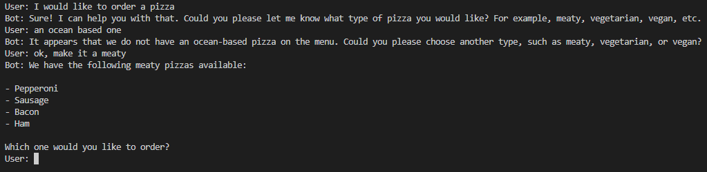
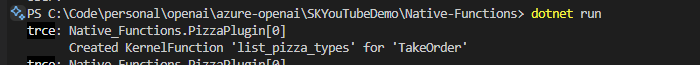

# Semantic Kernel Native Functions

OK - this is probably the coolest thing about SK (speaking as a dev)...Native functions allow us to wrap new or existing code in a function that can be injected into the kernel, much like prompts. 

There are several ways to do this, but I personally prefer ```builder.Plugins.AddFromType``` as it gives me nice clean separation of code and the ability to port plugins to different projects very easily. 

# Techy-stuff
Lets get into the techy details first. If we explore the ```AddFromType``` mehtod, we can see that the ```KernelPluginFactory``` does most of the work. It has a generic method called ```CreateFromType<T>```... follow the breadcrumbs a few levels down and some reflection later you get a ```KernelPlugin```. The method that does the conversion is part of the Factory and is called ```CreateFromObject```.

OK, enough of that, lets build our first plugin.

# Building your first plugin
Plugins are normal classes, so the usual suspects like DI will apply as per usual. You decorate your methods with ```KernelFunction``` to make SK recognise it. A tip I read is to use snake_case for the functions as most of the LLMs are trained on Python... I took it at face value and never verified it, but it makes sense and I have not had any issues so far... Here is our starter class. 

```csharp
public class PizzaPlugin
{
    [KernelFunction(name: "list_pizza_types")]
    public string TakeOrder(
        string pizzaType
    )
    {
        return pizzaType switch
        {
            "meaty" => "Pepperoni, Sausage, Bacon, Ham",
            "vegan" => "Vegan Cheese, Spinach, Mushrooms, Olives",
            _ => "We don't have that type of pizza."
        };
    }
}
```
The ```CreateObject``` method we looked at earlier extracts methods and parameters, so SK is smart enough to pick figure it out, but let's give it some help by adding a description and return description for the function and explain what our parameters mean.

```csharp
public class PizzaPlugin
{
    [KernelFunction(name: "list_pizza_types")]
    [Description("List the types of pizza that are available.")]
    [return: Description("A list of pizzas that are available.")]
    public string TakeOrder(
        [Description("The type of pizza type, like meaty or vegan")] string pizzaType
    )
    {
        return pizzaType switch
        {
            "meaty" => "Pepperoni, Sausage, Bacon, Ham",
            "vegan" => "Vegan Cheese, Spinach, Mushrooms, Olives",
            _ => "We don't have that type of pizza."
        };
    }
}
```

This will help SK understand just that little bit better. It basically comes down to simple prompt engineering - the more specific you are - the better... Let's test the plugin...

# Hooking up the plugin.
Like the prompts, this is the easy part... a 1-liner again. We give it a name to control the plugin name, but reflection will use the class name if you don't give it a name...
```csharp
builder.Plugins.AddFromType<MyPlugin>("my_plugin");
```

Like with Prompts, you need to set the execution settings of the ```IChatCompletionService``` and pass the ```Kernel```

```csharp
OpenAIPromptExecutionSettings openAIPromptExecutionSettings = new OpenAIPromptExecutionSettings()
{
    ToolCallBehavior = ToolCallBehavior.AutoInvokeKernelFunctions,
};
```
```csharp
    ChatMessageContent response = await chat.GetChatMessageContentAsync(
        chatHistory: history,
        kernel: kernel,
        executionSettings: openAIPromptExecutionSettings
    );
```

Now we expect the bot to ask questions that correspond to the parameters of the method.



## How do I know my function was called. 

If you add logging to your kernel, you can see when functions are called. You can also add Filters (middleware), we will cover that later. 

First, add logging packages

```xml
    <PackageReference Include="Microsoft.Extensions.Logging" Version="8.0.0" />
    <PackageReference Include="Microsoft.Extensions.Logging.Console" Version="8.0.0" />
```

Then add logging to your kernel builder

```csharp
builder
    .Services
    .AddLogging(loggingBuilder => loggingBuilder.AddConsole().SetMinimumLevel(LogLevel.Trace));

```
You can see your plugin being called 😊



That's it for today. 

Next up we will look at RAG with the various vectors stores - I personally use Azure AI Search in most of my apps, but you can connect quite a variety of vector stores. 

If you want to learn more about Native functions, visit the [SK site](https://learn.microsoft.com/en-us/semantic-kernel/concepts/plugins/adding-native-plugins?pivots=programming-language-csharp)