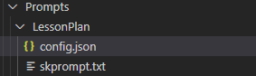

Not everyone is a prompting prodigy. Let's be honest, it's a tough new skill to get used to - especially if you aren't a technically minded person. Seeing as the value of LLMs are somewhat linked to our ability to prompt, it feels like a skill we should be getting good at, but as with all tech, most people just couldn't be bothered.

Now, in most cases, a simple Q&A is good enough to get you going with your LLM of choice, when we want to do something more creative, we need to carefully craft our prompts. Luckily, for us as devs, we don't have to leave the fate of our critical functionality in the hands of users. **Semantic Kernel** has some tricks that help us guard our most important prompts from users unknowingly sabotaging our beautiful chatbots...

When we think about productivity and chatbot beyond just simple RAG, **Semantic Kernel** gives us 3 (at the time of this article) options:
- Prompts
- Native Plugins
- Processes

**Prompts** are exactly what you think - preconfigured prompts that will ensure all the relevant variables are collected before executing the prompt. 
**Native Plugins** are a way for you to wrap some code in a nice - LLM Understandable - Prompt. More on this later...

## Why I love prompts

A quick personal note...

This is somewhat specific to people in professional services or consulting - but it is worth noting. As someone who is responsible for running a team of BAs and devs, prompts put us in an interesting position where I can send out my BAs to speak to other humans... and leave the devs to do their thing. The BAs would understand the business problems, get a sense for what the technical solution would need to do and explain that to the devs. The devs in turn write some plugins and services while the BAs can put the prompt in plain english. This maximises the skills of both types of resources in my team. Everybody knows how to prompt and has done the work to understand prompt engineering, but it is not a skill that does not require any programming skills, that is why BAs (especially the semi technical ones) are ideally placed to be my prompt engineers. 

## Background

Let's start with a quick example. I have been doing quite a bit of work in schools where we are helping teachers to reduce the time and effort it takes to do the admin that chews up so much of their time. An example of this would be to create lesson plans - sure you could do the same boring lesson that has been going for 20 years, but that is boring and unfulfilling for both teacher and student.

Now, apart from integrating to their systems and pulling all kinds of data from external sources with plugins, we could help teachers very quickly standardize their approach to lesson planning by carefully constructing a prompt that collected the information we needed to build out a lesson plan in a structure that the teachers agreed on. **Semantic Kernel** is even smart enough to help us call our plugins automatically if the prompt is written well enough. Here is a basic workflow of what we needed to do in the lesson plan scenario:

- Come up with content on a specific topic (this could mean getting some content from the internet 😊).
- Understand what unit we are covering and what outcomes (or achievement standards) we are trying to meet. 
- Outline the material we need for the class.
- Give an introduction to the lesson
- Explain the content (this is mostly up to the teacher, but they could use the app we built to get help with that)
- Design 3 assignments based on student levels 
- Create a quick assessment / quiz to check the student knowledge at the end of the class
- Give a detailed account of which areas of the curriculum was covered in that lesson.

That is a lot to do... and they do it a few times a day... I thought school was rough for kids...

From there on out, Rubrics, Detailed Assessments etc. are created, but they follow the same recipe as we are explaining here, so I won't bore you with it. 

## Semantic Kernel Prompts

To start, you will have a folder in your project, typically called "Prompts". Each Prompt would then have its own folder with 2 files in - ```skprompt.txt``` and ```config.json```. 



```skprompt.txt``` is the file that will hold your prompt. 

```config.json``` will let **Semantic Kernel** know what variables are needed and how to work with various types of LLM models. 

### Building Prompts

The function you use to import prompts from a directory is  ```builder.Plugins.AddFromPromptDirectory``` which scans the directory you pass it and creates instances of a ```PromptTemplateConfig```.

The easy part is that it has a ```Template``` property that reads the content of skprompt.txt. Nothing fancy there. When it comes to the config, things are a bit more interesting. Let's take a look.

```
{
  "schema": 1,
  "description": "Generate a funny joke",
  "execution_settings": {
    "default": {
      "max_tokens": 1000,
      "temperature": 0.9,
      "top_p": 0.0,
      "presence_penalty": 0.0,
      "frequency_penalty": 0.0
    }
  },
  "input_variables": [
    {
      "name": "input",
      "description": "Joke subject",
      "default": ""
    },
    {
      "name": "style",
      "description": "Give a hint about the desired joke style",
      "default": ""
    }
  ]
}
```
Ok, so what is all that about? 

The ```PromptTemplateConfig``` has a static method ```FromJSON``` that, as you might guess, parses the JSON. The ```PromptTemplateConfig``` class has 2 main components we want to look at quickly. 

### Input Variables
The input variables have a few basic properties we have already seen and are mostly self explanatory, there is one we specifically need to look at now called ```AllowDangerouslySetContent```. As we will be using prompts with the ```IChatCompletionServivce```, it would be wise to set this to false to protect against prompt injection attacks. Here is a quick outline of the input variable class.


| Property                    | Type    | Description                                      |
|-----------------------------|---------|--------------------------------------------------|
| Name                        | string  | The name of the input variable                   |
| Description                 | string  | A brief description of the input variable        |
| Default                     | string  | The default value for the input variable         |
| IsRequired                  | bool | If set to false, the kernel won't force you to enter a value | 
| JsonSchema                  | string  | Serialized into a KernelJsonSchema instance | 
| AllowDangerouslySetContent  | bool  | Set to false when using prompts in IChatCompletion |


### Prompt Execution Settings

The ```Dictionary``` allows you to set specific execution rules based on which LLM model you are using. When using ```IChatCompletion``` you can set specific execution settings like ```temperature``` or ```maxTokens```, but we will take a look at how to do that manually later. For now, I would say knowing how creative you want your model to be (using ```temperature```) and capping your token usage (using ```maxTokens```) are the most important properties you need to know about. 

**_Quick note on ```maxTokens```_**
I was watching a Microsoft session on YouTube when they were talking about the APIM integration capabilities and the topic of ```maxTokens``` came up. This isn't as simple as capping responses, when using a chatcompletion service, if you don't put your ```maxTokens``` on the service call, you will consume the maximum amount of tokens the model allows - which will lead to more frequent ```429``` errors. So... use maxTokens...

### OpenAI Properties Explained


| Property          | Description                                                                                   |
|-------------------|-----------------------------------------------------------------------------------------------|
| `max_tokens`      | The maximum number of tokens to generate in the response. This includes both input and output tokens. |
| `temperature`     | Controls the randomness of the output. Higher values (e.g., 0.9) make the output more random, while lower values (e.g., 0.1) make it more focused and deterministic. |
| `top_p`           | Uses nucleus sampling to control the diversity of the output. A value of 0.0 means only the most likely tokens are considered. |
| `presence_penalty`| Penalizes new tokens based on whether they appear in the text so far, encouraging the model to talk about new topics. |
| `frequency_penalty`| Penalizes new tokens based on their existing frequency in the text so far, reducing the likelihood of repeating the same line verbatim. |


## Hooking it all up
After all that theory, the good news is, you can import all your prompts with a 1-liner. 

```csharp
builder.Plugins.AddFromPromptDirectory("Prompts");
```

At this stage, it is important to note that if you don't include the kernel in the ```GetChatMessageContentAsync``` or ```GetStreamingChatMessageContentsAsync``` calls, your chat completion service won't know anything about your fancy new prompts...

```
   ChatMessageContent response = await chat.GetChatMessageContentAsync(
        chatHistory: history,
        kernel: kernel
    );
```

Be sure to include your Prompts folder in your build... otherwise your app will break as soon as you run it.

```xml
<ItemGroup>
    <None Update="Prompts\**\*" CopyToOutputDirectory="PreserveNewest" />
</ItemGroup>
  ```

## Wrapping up
Where prompts become **INSANE** is that fact that they can be written in a way to call native functions (your code wrapped inside prompts) which we discuss I discuss in my next blog.

Until then, feel free to look up my [GitHub Repo](https://github.com/htaljaard/azure-openai) that has some demos on Semantic Kernel as well as a baseline infrastructure deployment to get started with a secure deployment - it needs a bit of work on your side (like setting tags and giving it a WAF certificate), but it is very close to be secure and usable OOB. 

